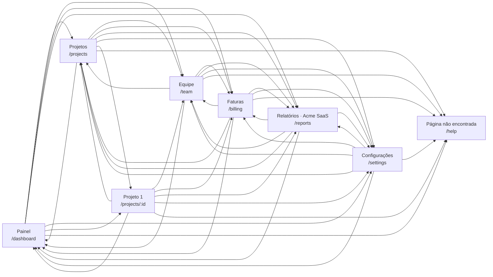

# Mapa do SaaS

```mermaid
graph LR
  dashboard["Painel<br/>/dashboard"]
  projects["Projetos<br/>/projects"]
  team["Equipe<br/>/team"]
  billing["Faturas<br/>/billing"]
  reports["Relatórios · Acme SaaS<br/>/reports"]
  settings["Configurações<br/>/settings"]
  projects_id["Projeto 1<br/>/projects/:id"]
  help["Página não encontrada<br/>/help"]
  dashboard --> projects
  projects --> dashboard
  projects --> team
  projects --> billing
  projects --> reports
  projects --> settings
  projects --> projects_id
  projects --> help
  dashboard --> team
  team --> dashboard
  team --> projects
  team --> billing
  team --> reports
  team --> settings
  team --> help
  dashboard --> billing
  billing --> dashboard
  billing --> projects
  billing --> team
  billing --> reports
  billing --> settings
  billing --> help
  dashboard --> reports
  reports --> dashboard
  reports --> projects
  reports --> team
  reports --> billing
  reports --> settings
  dashboard --> settings
  settings --> dashboard
  settings --> projects
  settings --> team
  settings --> billing
  settings --> reports
  settings --> help
  dashboard --> projects_id
  projects_id --> dashboard
  projects_id --> projects
  projects_id --> team
  projects_id --> billing
  projects_id --> reports
  projects_id --> settings
  projects_id --> help
  dashboard --> help
```
